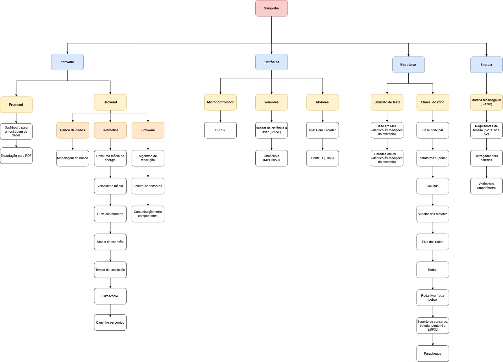

# Estrutura Analítica de Produto (EAP)

A EAP representa a decomposição hierárquica do escopo total do trabalho a ser executado pela equipe do projeto a fim de alcançar os objetivos e criar entregas exigidas.

- A EAP deve ser apresentada contemplando somente as entregas e pacotes de trabalho.
- A EAP não deve ter associação as fases do projeto
- A EAP não deve conter atividades.
- Inserir a imagem da representação da EAP.

Na imagem abaixo, temos a imagem do EAP do nosso projeto (Xaropinho). Nela, o produto foi dividido em: **Software**, **Eletrônica**, **Estruturas**, e **Energia**.

